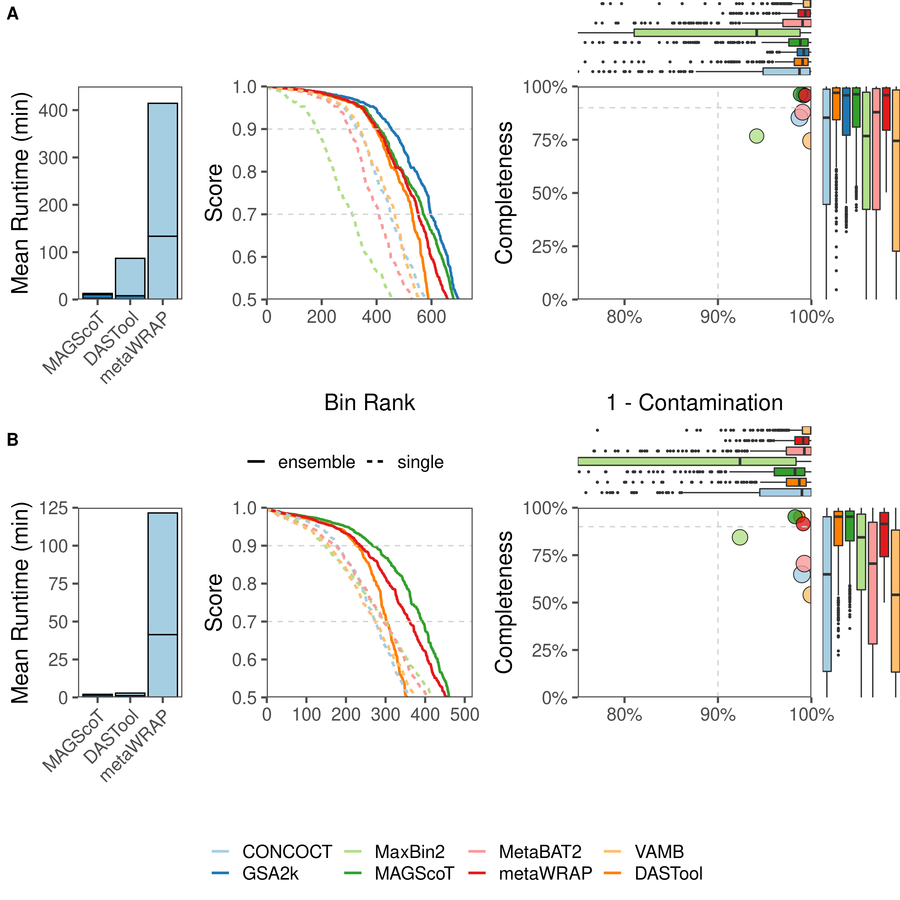

# MAGScoT

MAGScoT = MAG Scoring (and refinement) Tool

MAGScoT is pronounced like "Mascot".

MAGScoT is a fast tool for the scoring and refinement of metagenomic bins from different binning tools. A preprint is available via [BioRXiv](https://www.biorxiv.org/content/10.1101/2022.05.17.492251v1).

In brief, MAGScoT uses GTDBtk rel 207 (v2) marker genes to score completeness and contamination of metagenomic bins, to iteratively select the best metagenome-assembled genomes (MAGs) in a dataset. In addition, MAGScoT can merge overlapping metagenomic bins from multiple binning inputs and add these hybrid bins for scoring and refinement to the set of candidates MAGs.

MAGScoT outperforms existing tools on levels of computation time and resources, as well as quality and quanitity of recovered MAGs.



## Options

```
$ Rscript MAGScoT.R 
Usage: MAGScoT.R [options]


Options:
	-i CHARACTER, --input=CHARACTER
		Tab-separated input file with three columns: bin, contig, set; no header!

	--hmm=CHARACTER
		Tab-separated input file with marker mapping; three columns: gene id, marker, e-value. 
 Gene IDs must represent contig IDs after removal of _[0-9] at the end of the name (prodigal default)

	-p CHARACTER, --profile=CHARACTER
		Profile used for scoring, all derived from GTDB release 207. default[=bac120+ar53], ar53, bac120. [default]

	-o CHARACTER, --out=CHARACTER
		output file name base [default=MAGScoT]

	--bin_separator=BIN_SEPARATOR
		Separator for refined output bin names [default=cleanbin]

	-a SCORE_A, --score_a=SCORE_A
		Scoring parameter a [default=1]

	-b SCORE_B, --score_b=SCORE_B
		Scoring parameter b [default=0.5]

	-c SCORE_C, --score_c=SCORE_C
		Scoring parameter c [default=0.5]

	--max_cont=MAX_CONT
		Maximum contamination; MAGs with values higher than this threshold are not considered [default=1]

	-t THRESHOLD, --threshold=THRESHOLD
		Scoring minimum completeness threshold [default=0.5]

	--score_only
		Only do scoring, no refinement [false]

	--skip_merge_bins
		Skip bin merging [false]

	-m MIN_MARKERS, --min_markers=MIN_MARKERS
		Minimum number of unique markers in bins to be considered as seed for bin merging [default=25]

	-s MIN_SHARING, --min_sharing=MIN_SHARING
		Minimum percentage of shared markers for bin sharing. [default=0.8]

	-n N_ITERATIONS, --n_iterations=N_ITERATIONS
		Number of merging iterations to perform. [default=2]

	-h, --help
		Show this help message and exit
```

## Usage

### Stand alone Rscript

MAGScoT can be run in a conda environment

```
conda create -n MAGScoT_env
conda activate MAGScoT_env

conda install mamba
mamba install -c conda-forge -c bioconda -c r r-base r-optparse r-dplyr r-readr r-funr r-digest hmmer prodigal parallel

git clone https://github.com/ikmb/MAGScoT

MAGScoT_folder="/path/to/MAGScoT"
cd $MAGScoT_folder/example

Rscript $MAGScoT_folder/MAGScoT.R -i example.contigs_to_bin.tsv --hmm example.hmm

```

### Run MAGScoT as Docker Container

Alternatively, MAGScoT can be run via the Docker Container.

```
MAGScoT_folder="/path/to/MAGScoT"

docker run -v `pwd`:`pwd` ikmb/magscot:latest -i $MAGScoT_folder/example/example.contig_to_bin.tsv --hmm $MAGScoT_folder/example/example.hmm

```

## Pre-processing

### 1. Single Copy Marker identification (GTDBtk rel 207)

```
MAGScoT_folder="/path/to/MAGScoT"

cd $MAGScoT_folder/example

### ORF detection with prodigal
zcat example.contigs.fasta.gz | prodigal -p meta -a example.prodigal.faa -d example.prodigal.ffn -o tmpfile

### ALTERNATIVE: Fast parallel ORF detection with prodigal
# mkdir -p tmp_workfolder
# zcat example.contigs.fasta.gz | parallel -j 8 --block 999k --recstart '>' --pipe prodigal -p meta -a tmp_workfolder/example.{#}.faa -d tmp_workfolder/example.{#}.ffn -o tmpfile
# cat tmp_workfolder/example.*.faa > example.prodigal.faa
# cat tmp_workfolder/example.*.ffn > example.prodigal.ffn
# rm -r tmp_workfolder tmpfile

### annotation of protein sequences using HMMer and GTDBtk r207 marker genes
hmmsearch -o example.hmm.tigr.out --tblout example.hmm.tigr.hit.out --noali --notextw --cut_nc --cpu 8 $MAGScoT_folder/hmm/gtdbtk_rel207_tigrfam.hmm example.prodigal.faa
hmmsearch -o example.hmm.pfam.out --tblout example.hmm.pfam.hit.out --noali --notextw --cut_nc --cpu 8 $MAGScoT_folder/hmm/gtdbtk_rel207_Pfam-A.hmm example.prodigal.faa

cat example.hmm.tigr.hit.out | grep -v "^#" | awk '{print $1"\t"$3"\t"$5}' > example.tigr
cat example.hmm.pfam.hit.out | grep -v "^#" | awk '{print $1"\t"$4"\t"$5}' > example.pfam
cat example.pfam example.tigr > example.hmm
```

### 2. Formatting of contig to bin file

individual contig to bin files from binning algorithms

Format: 	`BIN<tab>CONTIG`

E.g.:	`metabat_bin_01<tab>contig_20`

```
awk '{print $1"\t"$2"\tvamb"}'  example.vamb.contigs_to_bin.tsv > example.contigs_to_bin.tsv
awk '{print $1"\t"$2"\tconcoct"}'  example.concoct.contigs_to_bin.tsv >> example.contigs_to_bin.tsv
awk '{print $1"\t"$2"\tmetabat2"}'  example.metabat2.contigs_to_bin.tsv >> example.contigs_to_bin.tsv
awk '{print $1"\t"$2"\tmaxbin2"}'  example.maxbin2.contigs_to_bin.tsv >> example.contigs_to_bin.tsv
```

Final contig to bin file for all algorithms

Format:	`BIN<tab>CONTIG<tab>BINNER`

E.g:		`metabat_bin_01<tab>contig_20<tab>metabat`


### 3. MAGScoT bin scoring and refinement

```
Rscript $MAGScoT_folder/MAGScoT.R -i example.contigs_to_bin.tsv --hmm example.hmm
```

Running the MAGScoT algorithm for bin merging and refinement


# Funding

The project was funded by the German Research Foundation (DFG) [Collaborative Research Center 1182 - Origin and Function of Metaorganisms](https://www.metaorganism-research.com/) and DFG [Research Unit 5042 - miTarget](https://www.mitarget.org/).
